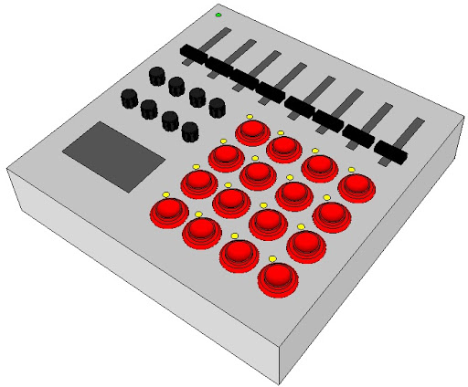

# Arduino-MIDI-controller
A MIDI controller implemented on Arduino

Using the Arduino MIDI library we can generate midi signals with a certain NOTE, VELOCITY and CHANNEL.

These MIDI signals are transport over a MIDI cable. Our PC did not come with a MIDI port (although there
are MIDI adapters available).

We use a virtual MIDI port, for example LoopMIDI. This creates a virtual loopback MIDI-port to interconnect applications on Windows that want to open hardware-MIDI-ports for communication.
The MIDI signals that Arduino sends, go through the Hairless MIDI software to the virtual MIDI port.
Hairless MIDI provides a MIDI to serial signal interface.
A musical production tool (I am fan of Ableton) recognizes the virtual MIDI port and is able to process
the signals.

# Additional Software
A list of the necessary software used in this project.

- [Arduino IDE](https://www.arduino.cc/en/main/software)
- [loopMIDI](https://www.tobias-erichsen.de/software/loopmidi.html)
- [Hairless-MIDI](http://projectgus.github.io/hairless-midiserial/)

Note: the software has been build and tested only for Windows.
The Arduino IDE and the Hairless-MIDI are cross platform, so compilation on Linux and macOS
should work. For both the latter platforms, there should exist equivalent software to emulate
a virtual loopback MIDI-port.

# Development Environment
